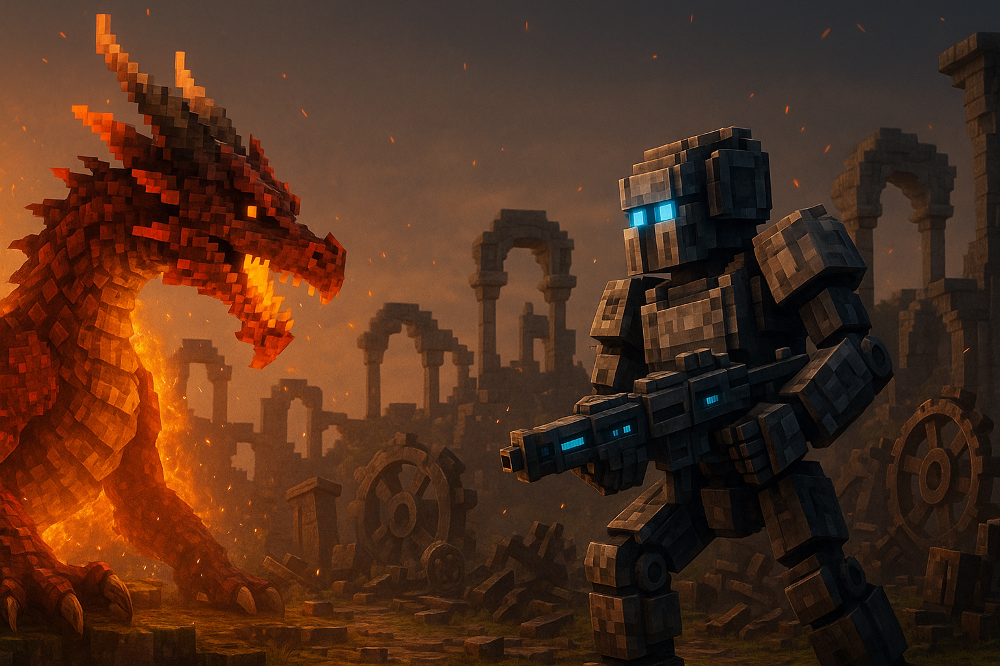

# 🔥 灰烬与龙焰：永燃之战 | Ash & Dragonfire: Eternal War

<div align="center">

[](https://www.minecraft.net/)
[](https://files.minecraftforge.net/)
[](LICENSE)
[](https://github.com/glasses666/ashdragonfire)

**一个史诗级的阵营对抗模组，在魔法与科技的战争中选择你的命运**

[English](README_EN.md) | [简体中文](README.md)

</div>

---

## 🎮 核心特色

> **在龙族的魔法与人类的科技之间，你将如何选择？**

《灰烬与龙焰》是一个大型 PvP/PvE 阵营对抗模组，玩家可以加入龙族或人类阵营，体验完全不同的游戏风格：

### 🐉 龙族阵营 - 魔法与飞行
- 🔮 **龙形变身** - 从幼龙成长为上古巨龙
- ⚡ **龙语魔法** - 火焰、风暴、岩浆、电击等元素技能
- 🌊 **魔力系统** - 独特的 Mana 能量机制
- 🦅 **天空霸主** - 飞行与俯冲攻击

### ⚙️ 人类阵营 - 科技与火力
- 🔫 **机械武器** - 能量步枪、火炮、机械臂
- 🚁 **飞艇载具** - 可驾驶的空中堡垒
- ⚡ **能量科技** - Forge Energy (FE) 系统
- 🏭 **工业建筑** - 机械工作台、能量核心

### 🎯 阵营转换系统 ⭐ NEW!
- 🔮 **龙魂引** - 驯服龙族，获得忠诚伙伴
- 🧪 **灰烬之血药剂** - 将人类转化为誓火者
- ⚡ **神经支配者** - 用科技控制龙族
- 📜 **龙语卷轴** - 和平说服人类加入龙族

---

## 📊 开发进度

### v0.2 Alpha - 当前版本

| 模块 | 进度 | 状态 |
|------|------|------|
| 阵营系统 | ████████░░ 80% | 🟡 开发中 |
| 转换系统 | ██████████ 100% | ✅ 完成 |
| 技能系统 | ██████░░░░ 60% | 🟡 开发中 |
| 实体AI | ██████████ 100% | ✅ 完成 |
| 世界生成 | ████░░░░░░ 40% | 🟡 开发中 |
| GUI界面 | ██░░░░░░░░ 20% | 🔴 计划中 |
| 多人同步 | ██████████ 100% | ✅ 完成 |

### 里程碑

- [x] **v0.1 Prototype** - 基础框架和注册系统
- [x] **v0.2 Alpha** - 阵营转换系统完成
- [ ] **v0.5 Beta** - 完整战斗与世界生成
- [ ] **v1.0 Release** - 正式发布到 CurseForge

---

## 🚀 快速开始

### 玩家使用

1. **下载模组**
   ```bash
   # 从 Releases 页面下载最新版本
   https://github.com/glasses666/ashdragonfire/releases
   ```

2. **安装 Forge**
   - 下载并安装 [Forge 1.21.1](https://files.minecraftforge.net/)
   - 将模组文件放入 `.minecraft/mods/` 文件夹

3. **开始游戏**
   - 进入世界后，使用 `/faction join <dragon/human>` 加入阵营
   - 查看技能树：按 `K` 键（默认）

### 开发者使用

1. **克隆仓库**
   ```bash
   git clone https://github.com/glasses666/ashdragonfire.git
   cd ashdragonfire
   ```

2. **导入 IDE**
   ```bash
   # IntelliJ IDEA
   ./gradlew genIntellijRuns
   
   # Eclipse
   ./gradlew genEclipseRuns
   ```

3. **运行游戏**
   ```bash
   # 客户端
   ./gradlew runClient
   
   # 服务器
   ./gradlew runServer
   ```

详细开发指南请查看 [DEVELOPMENT.md](DEVELOPMENT.md)

---

## 📖 游戏机制

### 阵营系统

#### 声望等级
| 等级 | 名称 | 所需声望 | 解锁内容 |
|------|------|---------|---------|
| 1 | 新兵 | 0 | 基础装备 |
| 3 | 老兵 | 500 | 中级技能 |
| 5 | 精英 | 2000 | 高级装备 |
| 7 | 英雄 | 5000 | 史诗技能 |
| 10 | 不朽 | 10000 | 传说装备 |

#### 获取声望
- 击败敌对阵营单位：+10
- 占领资源点：+50
- 完成阵营任务：+100
- 参与战争事件：+200

### 转换系统

#### 4种转换方式

1. **龙魂引**（Dragon Soul Lure）
   - 目标：野生龙族
   - 成功率：50-90%（取决于声望）
   - 效果：龙族成为忠诚伙伴，可骑乘

2. **灰烬之血药剂**（Ash Blood Potion）
   - 目标：人类单位
   - 成功率：100%
   - 效果：转化为誓火者，获得龙鳞装甲

3. **神经支配者**（Neural Dominator）
   - 目标：龙族
   - 成功率：100%
   - 效果：洗脑为机械化巨龙，高防御

4. **龙语卷轴**（Dragon Tongue Scroll）
   - 目标：人类单位
   - 成功率：40-80%（取决于声望）
   - 效果：和平说服，保留原有装备

详细配方请查看 [CONVERSION_RECIPES.md](CONVERSION_RECIPES.md)

---

## 🎨 截图展示

> 🚧 开发中，即将添加游戏截图和演示视频

---

## 🛠️ 技术特性

### 代码架构
- ✅ 模块化设计（core, content, systems, client）
- ✅ 使用 DeferredRegister 注册系统
- ✅ 事件驱动架构
- ✅ Capability 数据持久化
- ✅ 网络同步支持多人游戏

### 性能优化
- ⚡ AI 寻路频率控制（每 10 tick）
- ⚡ 网络包数据压缩（~200 字节）
- ⚡ Capability 懒加载
- ⚡ 延迟更新（Lazy Tick）

### 兼容性
- 🔌 支持 JEI（Just Enough Items）
- 🔌 支持 Curios API
- 🔌 支持 GeckoLib 动画
- 🔌 支持 Forge Energy (FE)

---

## 📚 文档

- [开发指南](DEVELOPMENT.md) - 如何参与开发
- [快速开始](QUICKSTART.md) - 玩家使用教程
- [转换系统](CONVERSION_SYSTEM_DESIGN.md) - 转换机制详解
- [配方大全](CONVERSION_RECIPES.md) - 所有物品配方
- [API 文档](docs/API.md) - 第三方扩展接口
- [更新日志](CHANGELOG.md) - 版本更新记录

---

## 🤝 贡献

我们欢迎任何形式的贡献！

### 如何贡献

1. Fork 本仓库
2. 创建你的特性分支 (`git checkout -b feature/AmazingFeature`)
3. 提交你的更改 (`git commit -m 'Add some AmazingFeature'`)
4. 推送到分支 (`git push origin feature/AmazingFeature`)
5. 开启一个 Pull Request

### 贡献指南

- 代码风格：遵循 Java 标准命名规范
- 提交信息：使用清晰的英文描述
- 测试：确保新功能有对应的测试
- 文档：更新相关的文档说明

详见 [CONTRIBUTING.md](CONTRIBUTING.md)

---

## 🐛 问题反馈

发现 Bug 或有新想法？

- [报告 Bug](https://github.com/glasses666/ashdragonfire/issues/new?template=bug_report.md)
- [功能建议](https://github.com/glasses666/ashdragonfire/issues/new?template=feature_request.md)
- [提问讨论](https://github.com/glasses666/ashdragonfire/discussions)

---

## 📜 许可证

本项目采用 MIT 许可证 - 详见 [LICENSE](LICENSE) 文件

---

## 👥 开发团队

- **GlasserDraco** - 项目创建者与主要开发者
- **Manus AI** - AI 辅助开发

---

## 🌟 致谢

感谢以下项目和社区的支持：

- [Minecraft Forge](https://github.com/MinecraftForge/MinecraftForge) - 模组开发框架
- [GeckoLib](https://github.com/bernie-g/geckolib) - 动画库
- [JEI](https://github.com/mezz/JustEnoughItems) - 物品查询
- Minecraft 模组开发社区

---

## 📞 联系方式

- GitHub: [@glasses666](https://github.com/glasses666)
- 项目主页: [ashdragonfire](https://github.com/glasses666/ashdragonfire)

---

<div align="center">

**⭐ 如果你喜欢这个项目，请给我们一个 Star！⭐**

Made with ❤️ by GlasserDraco

</div>

